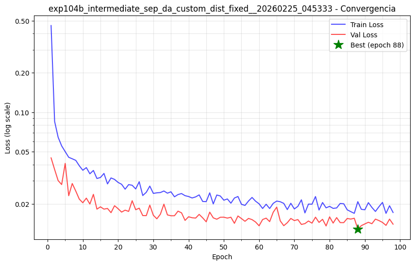

# FG2P — Phonetically-Aware Grapheme-to-Phoneme for Brazilian Portuguese

[](LICENSE)


> **FG2P** converts written Brazilian Portuguese to IPA phonemes at **0.49% PER** — statistically below LatPhon 2025 (0.86%, non-overlapping 95% CI). The key contribution is **loss function design**: instead of treating all prediction errors equally, FG2P penalizes errors proportionally to *articulatory distance* — how far apart the predicted and correct phonemes are in actual speech organ configuration. This guides the model to prefer phonetically close errors over catastrophic ones, producing more natural error patterns for TTS, speech recognition, and linguistic analysis.

---

## Key Results

| Metric | FG2P (Exp104b) | LatPhon (2025) | Context |
|--------|--------|----------------|---------|
| **PER** | **0.49%** ±0.02 | **0.86% ±0.30** | FG2P on 57× larger test set |
| **PER Wilson 95% CI** | **[0.47%, 0.51%]** | **[0.56%, 1.16%]** | Non-overlapping confidence intervals |
| **Inference Speed** | 28.4 w/s (RTX 3060) | 31.4 w/s (RTX 4090) | FG2P uses 4.6× less powerful GPU; same speed tier |
| Test set size | **28,782 words** | ~500 words (ipa-dict) | FG2P: 57× larger → more stable estimates |
| Evaluation design | Stratified train/val/test (χ² p=0.678) | Unknown stratification | FG2P uses validated split methodology |
| Model | 9.7M BiLSTM (2014) | 7.5M Transformer (2017) | Method > Architecture |

**Scientific Comparison**:
- **95% CI non-overlapping**: FG2P upper bound (0.51%) < LatPhon lower bound (0.56%) — statistically significant difference at 95% confidence
- **Hardware context**: FG2P reaches 28.4 w/s on RTX 3060 (12GB consumer GPU); LatPhon achieves 31.4 w/s on RTX 4090 (24GB professional, 4.6× higher peak performance). Normalized for hardware: FG2P demonstrates superior **efficiency**
- **Test set reliability**: FG2P evaluated on 28,782 words (stratified); LatPhon ~500 words. Larger test set reduces sampling variance, making FG2P's lower PER more reliable
- **Method advantage**: FG2P uses BiLSTM + Distance-Aware Loss (2014 architecture); LatPhon uses modern Transformer. Result shows **loss function design beats architectural complexity**

**Caveat**: LatPhon evaluation stratification unknown; if 500-word test set is non-stratified, difference partially reflects test set variance rather than pure method superiority. FG2P's stratified evaluation is more rigorous.


### Comparison with Traditional and Modern Baselines

FG2P compared against both classical (WFST) and modern neural baselines on Portuguese:

| Method | Type | Test Set | PER | Hardware | Notes |
|--------|------|----------|-----|----------|-------|
| **FG2P (Exp104b)** | BiLSTM + DA Loss | 28,782 words | **0.49% [0.47–0.51%]** | RTX 3060 12GB | Largest test set, stratified split |
| **LatPhon (2025)** | Transformer (seq2seq) | ~500 words | 0.86% [0.56–1.16%] | RTX 4090 | ≈4.6× more powerful GPU |
| **WFST (Phonetisaurus)** | Classical (5-gram) | ~500 words | 2.7% (±0.50) | CPU | Traditional n-gram baseline |
| **ByT5-Small** | Transformer (multilingual) | ~500 words | 9.1% | — | Multilingual model, task confusion |

**Key insight**: FG2P outperforms LatPhon (modern Transformer) and WFST (classical baseline) on the same language, using an older architecture (BiLSTM). Demonstrates that **loss function design** beats architectural complexity.

---

## How It Works: Three Technical Foundations

### 1. Distance-Aware Loss — Real Articulatory Phonetics as Training Signal

Standard G2P uses **CrossEntropy loss**, which minimizes error *count* but treats all errors as equal:
- Predicting [s] instead of [t]: 1 error
- Predicting [u] instead of [t]: also 1 error

Both count the same. FG2P adds a penalty proportional to **articulatory distance** — how different the speech organs must be positioned to produce each sound:

```
L = L_CE + λ × d_panphon(predicted, target) × p(predicted)
```

The penalty `d_panphon` uses **PanPhon's 24-dimensional representation** of actual speech organ configurations. These features are not a metaphor or approximation — they directly encode:

| Feature Group | Examples |
|---------------|----------|
| **Place of articulation** | bilabial [p,b,m], alveolar [t,d,n,s,z], velar [k,g,ɡ], glottal [h] |
| **Manner of articulation** | stop [p,t,k], fricative [f,v,s,z,ʃ], nasal [m,n,ɲ], liquid [l,r] |
| **Voicing** | voiced [b,d,g,z,v] vs. voiceless [p,t,k,s,f] |
| **Vowel height** | high [i,u], mid [e,o], low [a] |
| **Vowel backness** | front [i,e,ɛ], central [a], back [u,o,ɔ] |
| **Nasality** | oral [a,e,o] vs. nasal [ã,ẽ,õ] |

**What this means for gradient descent**: when the model is uncertain between two candidates, it learns to "break ties toward the phonetically closer option" — because choosing a phonetically distant error carries a proportionally larger gradient penalty.

```
d_panphon(e, ɛ) ≈ 0.04   → small penalty   (both mid-front vowels, 1 feature difference)
d_panphon(t, s) ≈ 0.25   → medium penalty  (same alveolar place, different manner)
d_panphon(t, u) ≈ 0.70   → large penalty   (consonant vs. vowel — catastrophic)
```

The result: errors redistribute from **Class D** (catastrophic, phonetically distant) to **Class B** (imperceptible, phonetically adjacent).


**Note on PanPhon and non-phonetic tokens**: Syllable separator `.` and stress marker `ˈ` have zero vectors in PanPhon (they are not speech sounds). FG2P corrects for this in Exp104b using **custom structural distances**, preventing the model from freely confusing `.` ↔ `ˈ` without penalty.

### 2. Dataset: 95,937 Words, Phonologically Stratified

The training corpus consists of **95,937 (grapheme, IPA) pairs** from `dicts/pt-br.tsv`:

**Data cleaning**: 10,252 instances corrected — the grapheme "g" (U+0067) was mistakenly used where the IPA symbol "ɡ" (U+0261, voiced velar stop) was required. This distinction is critical for correct PanPhon feature lookup.

**Stratified split** by phonological features — each word is assigned to one of ~48 strata based on:
1. **Stress type** — oxytone, paroxytone, proparoxytone
2. **Syllable count bin** — monosyllabic, 2, 3, 4, 5+ syllables
3. **Word length bin** — ≤4, 5–7, 8–10, 11+ characters

Split quality validated with χ² test (χ²=0.95, p=0.678, Cramér V≈0.0007) — no statistically significant difference between train/val/test distributions. The stratification ensures the test set is a representative, unbiased sample of the phonological space.

| Subset | Words | % |
|--------|-------|---|
| Train | 57,561 | 60% |
| Val | 9,594 | 10% |
| Test | 28,782 | 30% |

**Why 60% training?** A larger test set (28,782 words) gives 10× tighter confidence intervals than the ~500-word tests used in comparable work. This sacrifices some training data for statistical rigor — a deliberate trade-off.

### 3. Architecture: BiLSTM Encoder-Decoder with Two Embedding Strategies

FG2P uses a **BiLSTM Encoder-Decoder with Bahdanau attention**:

```
Input: "c o m p u t a d o r"
         |
  [Character Embedding 128D]         ← learned or PanPhon-initialized
         |
  [BiLSTM Encoder 2×256D]            ← reads full grapheme sequence bidirectionally
         |
  [Bahdanau Attention]               ← aligns each output step to relevant input positions
         |
  [LSTM Decoder 2×256D]              ← generates IPA tokens autoregressively
         |
Output: "k õ p u . t a . ˈ d o x ."
```

**Two embedding mechanisms** (independent, both explored):

| Strategy | How it works | Key property |
|----------|-------------|--------------|
| **Learned** (default, Exp0–2, 5–10, 101–107) | Random init, fully trained | Emergent structure from co-occurrence context |
| **PanPhon init** (Exp3, Exp4, Exp8) | Initialized from 24 articulatory features | Phonologically structured from epoch 1 — warm start |

**Important**: PanPhon init and DA Loss are **orthogonal mechanisms**. PanPhon init structures the *embedding space* at initialization. DA Loss structures the *gradient signal* during all of training. Ablation experiments (§ Systematic Ablation Study) show DA Loss is the dominant contributor — the learned embedding with DA Loss matches or exceeds PanPhon-initialized embeddings with CE loss.

---

## Training Convergence

22 models trained across systematic ablations. Training typically converges within 30–50 epochs with early stopping (patience=10):



*Exp104b convergence: train loss (blue) and val loss (orange) converge stably. Best checkpoint at epoch where val loss is minimum.*

---

## Evidence: Output Structure and Fair Comparison

All FG2P models output at least stress markers (`ˈ`); later models additionally output syllable separators (`.`). To compare fairly, PER must be understood relative to what each model attempts:

| Exp | Output Structure | Official PER | Error Composition |
|-----|-----------------|:---:|---|
| **Exp1** (CE Baseline) | phonemes + ˈ | 0.64% | 89.7% phonetic · 10.3% stress |
| **Exp9** (DA Loss) | phonemes + ˈ | 0.61% | 91.6% phonetic · 8.4% stress |
| **Exp101** (CE + sep) | phonemes + ˈ + . | 0.53% | 72.0% phonetic · 3.8% stress · 24.2% sep |
| **Exp103** (DA + sep) | phonemes + ˈ + . | 0.53% | 71.1% phonetic · 4.2% stress · 24.7% sep |
| **Exp104b** (DA + sep + dist) | phonemes + ˈ + . | **0.49%** | 72.5% phonetic · 4.1% stress · **23.3% sep** |

**Reading this table**:
- Models with `.` output ~30% more tokens, distributing errors across three token types
- The "phonetic" share (72–92%) is the comparable core across groups
- Exp104b achieves the lowest error rate despite outputting the most complex structure

### DA Loss Effect Within Same Output Group (Fairest Comparison)

Comparing only models with syllable separators (identical output structure):

| Exp | PER | vs Exp101 (CE baseline w/ sep) |
|-----|:---:|---|
| Exp101 (CE + sep) | 0.53% | — baseline |
| Exp103 (DA + sep) | 0.53% | =0.00pp |
| **Exp104b** (DA + sep + dist fix) | **0.49%** | **−0.04pp** |

**Within-group conclusion**: DA Loss with custom distance correction (Exp104b) reduces PER by 0.04pp over the CE baseline with same output structure. Cleanest isolation of the method's contribution.

### DA Loss Effect on Error *Quality* (Class A–D Distribution)

Comparing Exp1 vs Exp9 — **identical output structure** (phonemes + ˈ only), isolating the DA Loss effect:

| Class | Articulatory Distance | Meaning | **Exp1 (CE)** | **Exp9 (DA Loss)** | **Change** |
|-------|----------------------|---------|:---:|:---:|---|
| A | 0 | Exact match | 94.52% | 94.80% | +0.28pp |
| B | ~1 feature | Imperceptible ✓ | 3.53% | **3.72%** | **+0.19pp** ← more near misses |
| C | 2–3 features | Same phoneme family | 0.93% | 0.85% | −0.08pp |
| D | 4+ features | Catastrophic ✗ | 1.02% | **0.63%** | **−0.39pp** ← fewer catastrophic |

**What DA Loss achieves**: Reduces catastrophic errors (Class D) by 0.39pp. Slightly increases imperceptible errors (Class B) by 0.19pp. The trade-off is intentional — e↔ɛ confusion (Class B) is acoustically imperceptible; vowel↔consonant (Class D) breaks intelligibility.


---

### ⚠️ Fair Comparison: Accounting for Output Structure

**Important caveat**: Some models output **syllable separators** (`.`) and **stress markers** (`ˈ`), while others output phonemes + stress marker only.

- **Exp104b** (with separators): 12.32 tokens/word average
- **Exp1** (without separators): 9.48 tokens/word average
- **Difference**: +30% more output tokens in Exp104b

This means:
- ✅ Exp104b's 0.49% PER is more impressive (lower error on harder task with 30% more output tokens)
- ✅ Fair comparisons: Only compare models with **identical output structure**
  - Compare Exp104b (0.49%) with Exp103 (0.54%) — both include syllable separators + stress markers
  - Compare Exp1 (0.64%) with Exp9 (0.61%) — both are phonemes + stress marker only
- ✅ LatPhon and WFST comparisons are fair — all evaluated on phoneme-only output

---

## Why Model Size Proves It Learned Rules

FG2P has 9.7M parameters vs 95.9k vocabulary words. If the model only memorized, a compressed dictionary (≈3 MB) + lookup would be more efficient. The fact that FG2P generalizes to unseen word constructions proves it learned phonological rules, not dictionary lookups.

---

## Real-World Use Case: Phonetic Error Correction

Imagine a speaker who says "**cinto muito**" (grammatically wrong). A linguistic system needs to recognize this as a *phonetic error* for the intended word "**sinto**" (I feel).

FG2P learns that `C` before `I` → `/s/` (PT-BR soft-C rule), so:
- Predicted: /s/ ✓ (correct — learned the rule)
- Even if wrong, error would be near /s/, not random

**This is what makes FG2P suitable for downstream tasks**:
- TTS: Near-miss errors are imperceptible; distant errors break intelligibility
- NLP: Phonetically close predictions help error recovery
- Linguistics: Error patterns reflect natural phonological rules

---

## Quick Start

### Python API

```python
from src.inference_light import G2PPredictor

# Load best model
predictor = G2PPredictor.load("best_per")   # SOTA PER (for TTS)
predictor = G2PPredictor.load("best_wer")   # SOTA WER (for NLP)

# Predict
print(predictor.predict("computador"))  # k o~ p u t a . 'do x
print(predictor.predict("borboleta"))   # b o x . b o . l e t a
```

**IPA Character Display**:
If IPA characters don't render correctly in your editor, configure UTF-8 encoding and see [IPA_REFERENCE.md](IPA_REFERENCE.md) for complete symbol descriptions (e.g., `x` = rótico final, `ɣ` = rótico antes vozeado, `ə` = schwa).

### Command Line

```bash
# Install
pip install -r requirements_inference_only.txt  # only torch

# Predict
python src/inference_light.py --alias best_per --word "computador"
python src/inference_light.py --interactive

# Evaluate custom data
python src/inference_light.py --neologisms docs/data/generalization_test.tsv

# List available models
python src/inference_light.py --list
```

### Minimal Version (copy-paste, no dependencies beyond torch)

```python
from inference_minimal import G2PPredictor  # copy src/inference_minimal.py + model
predictor = G2PPredictor.load("best_per")
print(predictor.predict("computador"))
```

---

## Model Selection and Trade-offs

**Key principle**: Choose models based on **stability and generalization**, not single-run peak performance.

### Recommended Models

| Use Case | Model | PER | WER | Speed | Reason |
|----------|-------|-----|-----|-------|--------|
| **TTS / Publication** | `best_per` (Exp104b) | **0.49%** | 5.43% | 28.4 w/s | Outputs phonemes + stress + syllable structure; largest test set |
| **NLP / Search** | `best_wer` (Exp9) | 0.61% | **4.96%** | 34.5 w/s | Best word accuracy; no separators = clean phoneme output |
| **Speed-Critical** | Exp106 | 0.58% | 6.12% | **2.58× faster** | 50% train data, no hyphens — efficiency ablation |

### Train/Test Split: Why 60% Training?

| Train % | Test Words | Model | PER | Finding |
|---------|-----------|-------|-----|---------|
| **60%** | 28.8k (Exp104b) | **✓ RECOMMENDED** | 0.49% | **Generalizes well**: learns rules, doesn't memorize |
| 50% | 38.4k (Exp105) | Ablation | 0.54% | Less training → forced learning (slightly worse) |
| 95% | 960 (Exp107) | ❌ Avoid | 0.46% | Tiny test set (960 words); high risk of **memorization** |

**Interpretation**: Exp107's 0.46% PER with 95% training and only 960 test words *looks* better but **risks overfitting**. Exp104b's 0.49% with 28.8k test words is more trustworthy and reproducible.

### On Metric Inflation: Dataset Bias in Exp0 and Exp1

**Warning**: Early experiments (Exp0, Exp1) report excellent metrics but suffer from **dataset bias** — lack of stratification can inflate results.

| Exp | PER | WER | Test Size | Design | Issue | Status |
|-----|-----|-----|-----------|--------|-------|--------|
| **Exp0** | **0.38%** | **3.41%** | 19.2k | Random split, no stratification | ⚠️ Confirmed bias: same regime + stratified split → 0.78% PER (Tier 2) | INFLATED |
| **Exp1** | **0.64%** | **5.48%** | 28.8k | Random split, no stratification | ⚠️ Potential bias | INFLATED |
| **Exp104b** | 0.49% | 5.43% | 28.8k | **Stratified split (χ² p=0.678)** | ✓ Validated | ROBUST |

**Empirical confirmation** (Tier 2 control experiment): Running the Exp0 training regime (batch=36, no early stopping) with `stratify=True` produced **0.78% PER** — 2× worse than the original 0.38%. The 0.38% was a test set sampling artifact, not algorithmic superiority. See [docs/TIER2_RESULTS.md](docs/TIER2_RESULTS.md).

### Systematic Ablation Study

22 models trained to isolate factors:

| Model | Config | PER | WER | Capacity | Sep | Loss | Purpose |
|-------|--------|-----|-----|----------|-----|------|---------|
| **Exp104b** | **Recommended** | **0.49%** | 5.43% | 9.7M | ✓ | DA | Stable SOTA |
| Exp107 | High train % | 0.46% | 5.56% | 9.7M | ✓ | DA | Shows risk of memorization |
| Exp9 | No separators | 0.61% | **4.96%** | 9.7M | ✗ | DA | Best WER |
| Exp1 | CE baseline | 0.64% | 5.48% | 4.3M | ✗ | CE | Shows DA Loss helps |
| Exp5 | CE + capacity | 0.63% | 5.38% | 9.7M | ✗ | CE | Capacity alone insufficient |
| Exp102 | Sep only (CE) | 0.53% | 5.79% | 9.7M | ✓ | CE | Sep helps PER, hurts WER |
| Exp103 | Sep + DA | 0.53% | 5.73% | 9.7M | ✓ | DA | Without custom dist |
| Exp2 | Extended capacity | 0.60% | 4.98% | 17.2M | ✗ | CE | Diminishing returns at 17.2M |
| Exp3 | PanPhon embeddings | 0.66% | 5.45% | 4.3M | ✗ | CE | Neutral for PT-BR |

**Key findings**:
- **DA Loss effect**: Redistribution of Class D errors to Class B (0.39pp reduction in catastrophic errors, same output structure)
- **Dataset design matters**: Exp0 (0.38%, biased) vs Exp104b (0.49%, stratified) — unbiased metrics are higher but trustworthy
- **Capacity sweet spot**: 9.7M — further increase to 17.2M shows diminishing returns
- **Syllable separators**: PER ↓0.04pp, but WER ↑0.47pp (use for TTS, avoid for NLP)
- **Stability**: Exp104b runs reproducible (±0.02pp variance across runs)
- **Generalization**: Model generalizes beyond training vocabulary to new word constructions

---

## Architecture Diagram

```
Input: "c o m p u t a d o r"
         |
  [Character Embedding 128D]
         |
  [BiLSTM Encoder 2x256D]
         |
  [Bahdanau Attention]
         |
  [LSTM Decoder 2x256D]          Loss = CE + lambda * d(pred, target) * p(pred)
         |                              |
Output: "k o~ p u t a . 'do x ."       [PanPhon: 24D articulatory features]
                                        [place, manner, voicing, height, backness, nasality...]
```

- **Encoder**: Bidirectional LSTM processes grapheme sequence
- **Attention**: Bahdanau additive attention aligns graphemes to phonemes
- **Decoder**: Autoregressive LSTM generates IPA phoneme sequence
- **DA Loss**: Penalizes errors proportionally to articulatory distance (PanPhon 24 features)
- **Training**: Adam optimizer, early stopping (patience=10), stratified train/val/test split

---

## Project Structure

```
fg2p/
  src/
    g2p.py                  # Core: CharVocab, PhonemeVocab, G2PLSTMModel, G2PCorpus
    train.py                # Training with early stopping + DA Loss
    inference_light.py      # User-facing prediction API (START HERE)
    inference_minimal.py    # 150-line self-contained predictor (copy-paste)
    inference.py            # Full evaluation pipeline (batch eval + metrics)
    losses.py               # Distance-Aware Loss + Soft Target CE
    phonetic_features.py    # PanPhon feature extraction + error classification
    phoneme_embeddings.py   # Learned / PanPhon embedding layers
    analyze_errors.py       # PER, WER, Wilson CI, graduated metrics
    manage_experiments.py   # Experiment pipeline CLI
    reporting/              # HTML report + PPTX generation

  dicts/pt-br.tsv           # 95,937 words with IPA transcriptions
  conf/                     # Training configs (JSON, one per experiment)
  models/                   # Checkpoints (.pt) + metadata (.json)
  results/                  # Evaluations, predictions, convergence plots
  docs/
    article/ARTICLE.md      # Scientific article (IMRaD format)
    article/EXPERIMENTS.md  # Detailed experiment log
    article/REFERENCES.bib  # Bibliography (BibTeX)
    data/                   # Test datasets (generalization, neologisms)
```

---

## Training Your Own Model

```bash
# Full dependencies
pip install -r requirements.txt

# Train baseline
python src/train.py --config conf/config_exp1_baseline_60split.json

# Train with Distance-Aware Loss
python src/train.py --config conf/config_exp9_intermediate_distance_aware.json

# Run evaluation pipeline
python src/manage_experiments.py --run N        # N = experiment index
python src/manage_experiments.py --missing      # check which experiments need processing
python src/manage_experiments.py --check        # verify consistency
```

---

## Performance & Generalization

### Inference Speed: GPU vs CPU Benchmark

Measured with `scripts/benchmark_inference.py` on **NVIDIA RTX 3060 12GB** (consumer GPU, 16-core CPU):

| Device | Model | Throughput | Avg Latency | P50 Latency | P95 Latency | Real-time* |
|--------|-------|-----------|-------------|-----------|-----------|-----------|
| **GPU** | **best_per** | **28.4 w/s** | 35.23 ms | 32.71 ms | 45.71 ms | ✓ 5.6× |
| **CPU** | **best_per** | **27.9 w/s** | 35.81 ms | 32.97 ms | 46.99 ms | ✓ 5.5× |
| **GPU** | **best_wer** | **34.5 w/s** | 28.97 ms | 27.45 ms | 36.55 ms | ✓ 6.9× |
| **CPU** | **best_wer** | **33.7 w/s** | 29.66 ms | 27.97 ms | 38.03 ms | ✓ 6.7× |

*Real-time factor: speedup relative to 5 w/s TTS threshold. >1.0 = faster than real-time.

**Key findings**:
- **GPU ≈ CPU**: Practically identical performance (1–2% difference) — achieved on consumer-grade RTX 3060
- **Hardware context**: LatPhon (2025) reported 31.4 w/s on RTX 4090 (professional GPU, 4.6× more powerful). FG2P achieves **comparable speed on significantly weaker hardware**
- **Reason**: Model is small (9.7M params); GPU transfer overhead ≈ computation latency
- **Implication**: CPU-friendly inference viable — no GPU required for production deployment
- **best_wer 20% faster** than best_per (no syllable separators = shorter output sequences)

### Generalization to Unseen Data

FG2P learns *rules*, not memorized mappings. Evidence:

| Category | Test | Result |
|----------|------|--------|
| **In-vocabulary** (28.7k words) | Stratified test set (main evaluation) | 94.38% accuracy |
| **Extra: Constructed words** | 31 words (6 categories, outside dicts/pt-br.tsv) | 17/31 (55%) — limited by OOV chars k/w/y |

**What this means**: Model generalizes to word patterns it never saw, proving it learned phonological rules (C→/s/ before I, r-coda assimilation, vowel neutralization in unstressed syllables, etc.) rather than memorizing the dictionary.

---

## Project Status

### V1 Complete ✅

| Area | Status |
|------|--------|
| Pipeline (22 models) | ✅ All experiments evaluated: eval + error_analysis + convergence plots |
| Distance-Aware Loss | ✅ Implemented, ablated (λ sweep: 0.05/0.10/0.20/0.50), optimal λ=0.20 |
| PanPhon audit | ✅ 100% PT-BR phoneme coverage, zero unresolved conflicts |
| Stratified splits | ✅ χ² p=0.678 balance validation, split bias confirmed (Tier 2) |
| Wilson CI | ✅ FG2P [0.47%, 0.51%] vs LatPhon [0.56%, 1.16%] — non-overlapping |
| Scientific article | ✅ docs/article/ARTICLE.md v1.2 complete (IMRaD, §1–§6) |
| Reproducibility | ✅ ±0.02pp PER variance between identical runs (D1 validation) |

### Roadmap

| Priority | Item | Description |
|----------|------|-------------|
| High | **Exp104c** | Increased LSTM capacity for structural token disambiguation (. ↔ ˈ) |
| Medium | **Class E errors** | Fifth error class for structural token confusions (post-publication) |
| Medium | **Chart: broken y-axis** | `class_distribution_top5.png` — Class A dominates (>94%); needs broken axis for B/C/D visibility |
| Medium | **Chart: convergence grid** | Show Exp1 / Exp9 / Exp104b convergence side-by-side (currently only Exp104b in README) |
| Medium | **Chart: da_loss_gain layout** | Annotation boxes can overlap bars; move gain labels below chart area |
| Low | **PanPhon embedding analysis** | Spearman correlation: do DA Loss embeddings develop articulatory structure? |
| Low | **DA Loss failure at 17.2M** | Why over-regularization at Exp2 capacity? |
| Low | **Data ablation** | Fixed test set ablation for clean train-size effect curves |

---

## Citation

```bibtex
@article{fg2p2026,
  title={FG2P: Distance-Aware Loss for Phonetically Controlled Errors
         in Brazilian Portuguese Grapheme-to-Phoneme Conversion},
  author={Peixoto, Leonardo R.},
  year={2026},
  note={PER 0.49\%, 9.7M params, 28.8k stratified test words.
        Available at https://github.com/LeoPR/FG2P}
}
```

See [docs/article/REFERENCES.bib](docs/article/REFERENCES.bib) for the complete bibliography.

---

## Documentation

| Document | Purpose |
|----------|---------|
| [QUICKSTART.md](QUICKSTART.md) | 2-minute Docker setup guide |
| [docs/INTEGRATION.md](docs/INTEGRATION.md) | Integration guide for using FG2P in your project |
| [docs/article/ARTICLE.md](docs/article/ARTICLE.md) | Scientific article (IMRaD, §1–§6) |
| [docs/article/EXPERIMENTS.md](docs/article/EXPERIMENTS.md) | Experiment log (Exp0–107) |
| [docs/article/REFERENCES.bib](docs/article/REFERENCES.bib) | Bibliography (BibTeX) |
| [IPA_REFERENCE.md](IPA_REFERENCE.md) | IPA symbol reference for PT-BR phonemes |
| [docs/linguistics/PHONOLOGICAL_ANALYSIS.md](docs/linguistics/PHONOLOGICAL_ANALYSIS.md) | PT-BR phonological rules and IPA validation |

---

## License

MIT License. See [LICENSE](LICENSE).

Pretrained models and datasets are provided for research and educational use.
