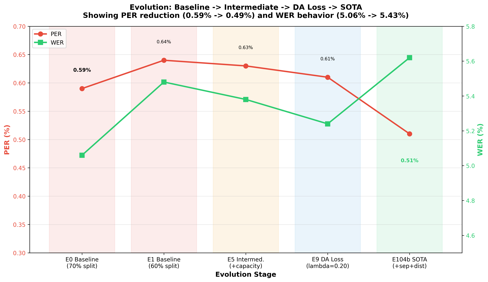
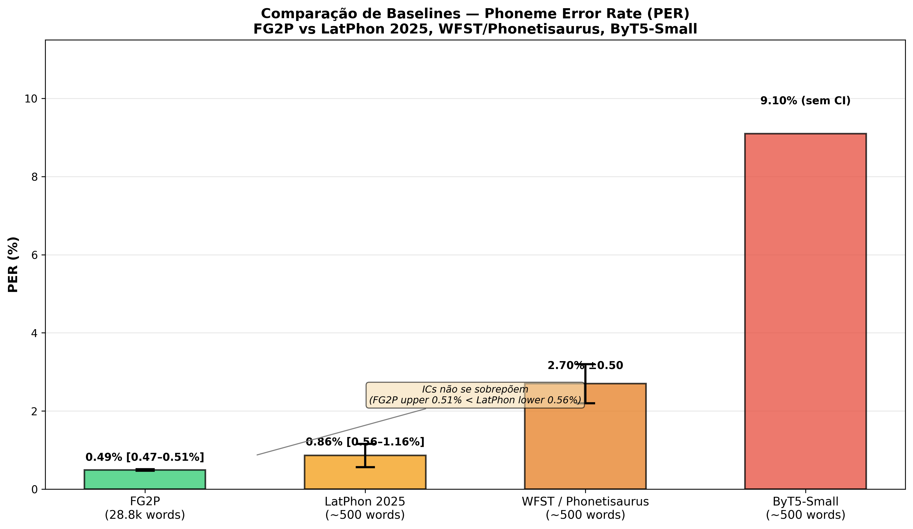
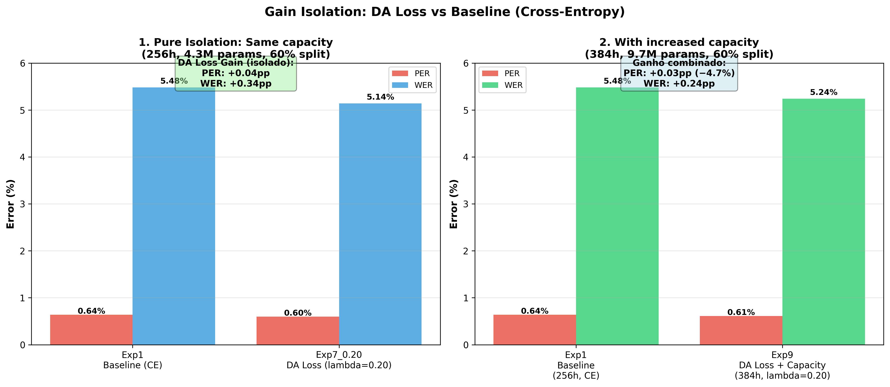
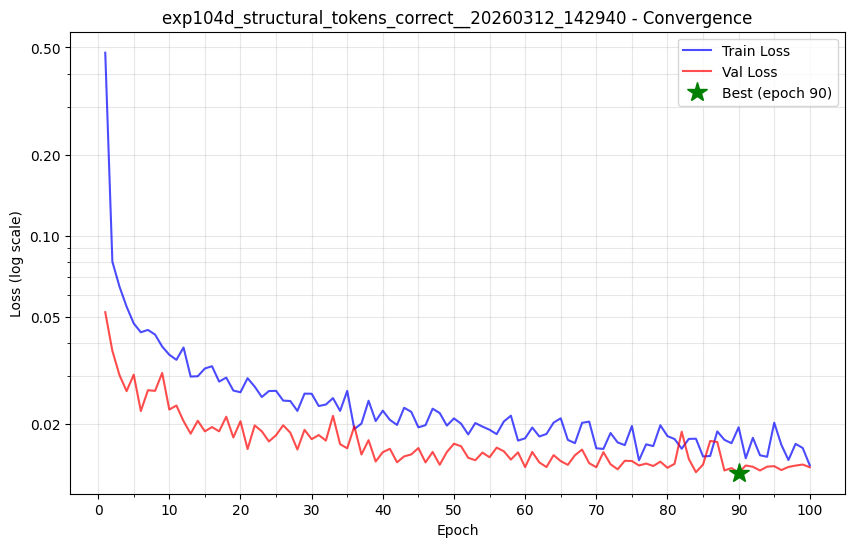
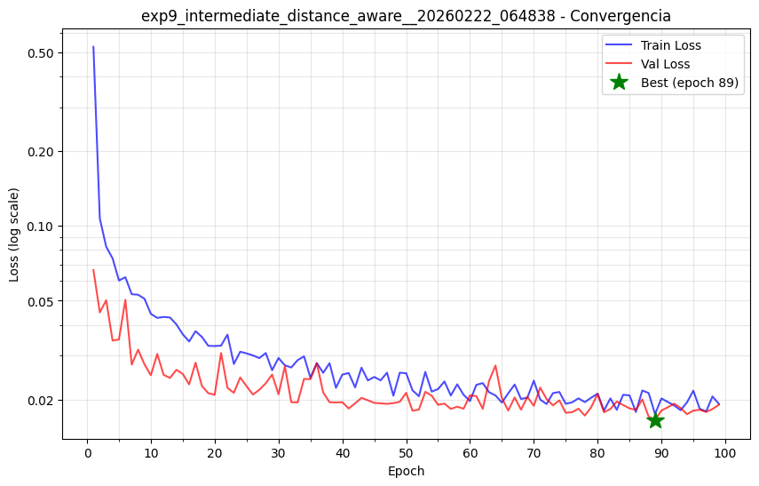
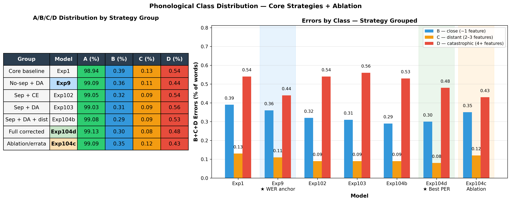

# FG2P — Phonetically-Aware Grapheme-to-Phoneme for Brazilian Portuguese

[](LICENSE)


> **FG2P** converts written Brazilian Portuguese to IPA phonemes with **PER = 0.48%** and **WER = 5.33%** on a stratified test set of 28,782 words (Exp104d). This repository emphasizes transparent evaluation: each claim is tied to explicit metrics, confidence intervals, and dataset context. FG2P uses a distance-aware training signal (PanPhon articulatory distance) to reduce severe phonetic confusions, while keeping comparisons with prior work bounded by clearly stated assumptions.

---

## Key Results

FG2P trained 22 model configurations in a systematic ablation study (§ Systematic Ablation Study below). The main reference in this README is Exp104d.

How to read these numbers:
- `Exp104d` is the main reference configuration for PER-centered reporting and external comparison.
- `Exp9` is the complementary reference configuration for WER-centered use cases.
- The comparison with LatPhon is anchored in PER because WER is not reported in that paper.
- `same source family (ipa-dict)` means the same lexical-resource lineage, not identical subsets or identical train/test splits.
- Residual micro-tradeoff: `Exp104b` is lighter and can be faster on CPU-only scenarios.

Version framing (lineage):
- `v1.0` milestone: `Exp104b` (historical PER milestone in the original cycle).
- `v1.1` consolidated reference: `Exp104d` (structural correction + current PER anchor for reporting).
- Reporting policy: unless explicitly stated otherwise, benchmark and comparison claims in this README use the `v1.1` (`Exp104d`) reference.

| Metric | FG2P (2026) | LatPhon (2025) | Context |
|--------|----------------|----------------|---------|
| **PER (Wilson 95% CI)** | **0.48% ± 0.03** | **0.86% ± 0.30** | PT-BR, same `ipa-dict` lineage, different subset sizes and splits; CIs do not overlap |
| **WER (Wilson 95% CI)** | **5.33% ± 0.26** | n/d | WER not reported for LatPhon |
| **Throughput (GPU)** | **1,500 w/s** | **31,4 w/s** | Reported throughput |
| **Throughput (CPU)** | **736 w/s** | **30,7 w/s** | Reported throughput |
| Test set size | **28,782 words** | ~500 words (ipa-dict) | FG2P test is 57× larger |
| Evaluation design | Stratified train/val/test (χ² p=0.678) | Stratification not reported | FG2P reports split validation explicitly |
| Model | 17.2M BiLSTM (2014) | 7.5M Transformer (2017) | Architectural families differ |

*Throughput methodology and hardware details: [docs/benchmarks/BENCHMARK.md](docs/benchmarks/BENCHMARK.md).* 

**Comparison criteria**: primary metric PER, auxiliary metric WER, uncertainty via Wilson 95% CI, and interpretation bounded to the reported dataset/hardware conditions. External comparison is PER-anchored because that is the metric shared with LatPhon.

**Reading guide**: the PER comparison is favorable to FG2P in this setup (non-overlapping CIs). Numerically, FG2P upper CI bound (0.51%) is below LatPhon lower CI bound (0.56%), while speed and architecture remain contextual trade-offs.

**Caveat**: splits and subset composition are not identical across works, so conclusions should be read as evidence for PT-BR `ipa-dict` conditions, not as a universal ranking.

Detailed experimental evolution and per-experiment motivation are documented in `docs/article/EXPERIMENTS.md`.



### Comparison with Traditional and Modern Baselines

FG2P compared against both classical (WFST) and modern neural baselines on Portuguese:

| Method | Type | Test Set | PER | Hardware | Notes |
|--------|------|----------|-----|----------|-------|
| **FG2P (2026)** | BiLSTM + DA Loss | 28,782 words | **0.48% [0.46–0.51%]** | RTX 3060 12GB | Exp104d; largest test set, stratified split |
| **LatPhon (2025)** | Transformer (seq2seq) | ~500 words | 0.86% [0.56–1.16%] | RTX 4090 | Higher-tier GPU; use as hardware context only |
| **WFST (Phonetisaurus)** | Classical (5-gram) | ~500 words | 2.7% (±0.50) | CPU | Traditional n-gram baseline |
| **ByT5-Small** | Transformer (multilingual) | ~500 words | 9.1% | — | Multilingual model, task confusion |

**Key insight**: In this PER-anchored evaluation setup, FG2P reports lower PER than the reported LatPhon and WFST PT-BR baselines. The non-overlapping PER intervals (FG2P 0.47-0.51% vs LatPhon 0.56-1.16%) support this reading under the documented conditions.



---

## How It Works: Three Technical Foundations

### 1. Distance-Aware Loss — What Was Used in Practice

Standard G2P training with **CrossEntropy (CE)** counts errors, but not their phonetic severity. FG2P keeps CE and adds one extra term to make severe phonetic substitutions cost more during training.

```
L = L_CE + λ × d_panphon(predicted, target) × p(predicted)
```

In practice, `d_panphon` comes from PanPhon articulatory features (24D). We used this as a **training signal**, not as a claim about full speech perception or semantics.

| Group | PanPhon dimensions (24D) | What they track |
|-------|---------------------------|-----------------|
| Segment type | `syl`, `son`, `cons` | syllabicity, sonority, consonantality |
| Manner | `cont`, `delrel`, `lat`, `nas`, `strid` | continuancy, delayed release, lateral, nasal, strident |
| Laryngeal | `voi`, `sg`, `cg` | voicing and glottal state |
| Place | `ant`, `cor`, `distr`, `lab`, `velaric` | anteriority, coronality, distribution, labiality, velaric activity |
| Vowel geometry | `hi`, `lo`, `back`, `round`, `tense` | vowel height, backness, rounding, tenseness |
| Length and prosody | `long`, `hitone`, `hireg` | length and tonal/prosodic flags in PanPhon |

**Important distinction**: PanPhon models **phonetic segments**. Symbols like `.` and `ˈ` are useful output markers in FG2P, but they are not phonemes; raw PanPhon gives them zero vectors. `<PAD>`, `<EOS>` and `<UNK>` are support codes, not speech sounds.

**Small penalty**: near phonetic neighbors, usually one articulatory distinction.

```
d_panphon(e, ɛ) ≈ 0.04
```

Typical interpretation: open vs closed vowel, oral vs nasal, voicing flip, or another local phonetic adjustment. This is the kind of error currently concentrated in **Class B**.

**Medium penalty**: same broad family, but no longer just a local tweak.

```
d_panphon(a, ə) ≈ 0.08
```

Typical interpretation: centralization, semivowel interaction, or a vowel-family shift that is still recognizably phonetic. This is the kind of error currently concentrated in **Class C**.

**Large penalty**: the prediction leaves the local phonetic neighborhood.

```
d_panphon(t, u) ≈ 0.70
```

Typical interpretation: vowel vs consonant, cluster collapse, or another segmental break that is no longer a small phonetic miss. This is the kind of error currently absorbed by **Class D**.

In matched-output comparisons, the practical effect is a redistribution of errors from **Class D** (catastrophic, distant) toward **Class B** (phonetically adjacent).



**Note on structural tokens**: Syllable separator `.` and stress marker `ˈ` have zero vectors in PanPhon, so FG2P applies **custom structural distances** (consolidated in Exp104d). The cleanest DA Loss isolation remains Exp1 vs Exp9 (same output structure).

**Open taxonomy point**: the current A-D reporting still absorbs some structural/support-code failures into **D** because `.` and `ˈ` receive maximum override distance. A future **Class E** is already on the TODO list for cases dominated by support symbols such as `.`/`ˈ`/`<PAD>` rather than by a true segmental phoneme substitution.

For stress marker `ˈ`, the interpretation is still open:
- if stress is preserved but shifted, it may deserve a lighter class than a segmental catastrophe;
- if `ˈ` is replaced by `.` or swallowed by `<PAD>`, that looks closer to a future structural **E** than to a phoneme-level **D**.

For theoretical background and related literature, see [docs/article/ARTICLE.md](docs/article/ARTICLE.md) and [docs/article/REFERENCES.bib](docs/article/REFERENCES.bib) (e.g., Mortensen et al., 2016; Browman and Goldstein, 1992; Barbosa and Albano, 2004).

### 2. Dataset: 95,937 Words, Phonologically Stratified

The training corpus consists of **95,937 (grapheme, IPA) pairs** from `dicts/pt-br.tsv`:

**Data cleaning**: 10,252 instances corrected — the grapheme "g" (U+0067) was mistakenly used where the IPA symbol "ɡ" (U+0261, voiced velar stop) was required. This distinction is critical for correct PanPhon feature lookup.

**Stratified split** by phonological features — each word is assigned to one of ~48 strata based on:
1. **Stress type** — oxytone, paroxytone, proparoxytone
2. **Syllable count bin** — monosyllabic, 2, 3, 4, 5+ syllables
3. **Word length bin** — ≤4, 5–7, 8–10, 11+ characters

Split quality validated with χ² test (χ²=0.95, p=0.678, Cramér V≈0.0007) — no statistically significant difference between train/val/test distributions. The stratification ensures the test set is a representative, unbiased sample of the phonological space.

| Subset | Words | % |
|--------|-------|---|
| Train | 57,561 | 60% |
| Val | 9,594 | 10% |
| Test | 28,782 | 30% |

**Why 60% training?** A larger test set (28,782 words) gives 10× tighter confidence intervals than the ~500-word tests used in comparable work. This sacrifices some training data for statistical rigor — a deliberate trade-off.

### 3. Architecture: BiLSTM Encoder-Decoder with Two Embedding Strategies

FG2P uses a **BiLSTM Encoder-Decoder with Bahdanau attention**:

```
Input: "c o m p u t a d o r"
         |
  [Character Embedding 128D]         ← learned or PanPhon-initialized
         |
  [BiLSTM Encoder 2×256D]            ← reads full grapheme sequence bidirectionally
         |
  [Bahdanau Attention]               ← aligns each output step to relevant input positions
         |
  [LSTM Decoder 2×256D]              ← generates IPA tokens autoregressively
         |
  [Softmax → ŷ (predicted token)]
         |
  ┌──────┴────────────────────────────────────────────────────────────────┐
  │  CrossEntropy (CE)   L_CE  = -log P(y_true)                           │
  │  Distance-Aware (DA) L_DA  = L_CE + λ × d_panphon(ŷ, y_true)        │  ← λ=0.20
  │                       d(·) from PanPhon 24-feature articulatory space  │
  └───────────────────────────────────────────────────────────────────────┘
         |
Output: "k õ p u . t a . ˈ d o x"
```

CE loss treats all substitution errors equally (predicting [u] instead of [t] = same penalty as predicting [s] instead of [t]). DA Loss adds an articulatory distance term: phonetically distant errors ([u]→[t], distance 0.875) are penalized more than close ones ([s]→[t], distance 0.125), making the gradient proportional to how "wrong" the error is.

**Two embedding mechanisms** (independent, both explored):

| Strategy | How it works | Key property |
|----------|-------------|--------------|
| **Learned** (default, Exp0–2, 5–10, 101–107) | Random init, fully trained | Emergent structure from co-occurrence context |
| **PanPhon init** (Exp3, Exp4, Exp8) | Initialized from 24 articulatory features | Phonologically structured from epoch 1 — warm start |

**Important**: PanPhon init and DA Loss are **orthogonal mechanisms**. PanPhon init structures the *embedding space* at initialization. DA Loss structures the *gradient signal* during all of training. Ablation experiments (§ Systematic Ablation Study) show DA Loss is the dominant contributor — the learned embedding with DA Loss matches or exceeds PanPhon-initialized embeddings with CE loss.

---

## Training Convergence

22 models trained across systematic ablations. Training typically converges within 30–50 epochs with early stopping (patience=10):

<table>
<tr>
<td align="center"><strong>Exp104d</strong> — DA Loss + sep + structural correction (Main PER reference)</td>
<td align="center"><strong>Exp9</strong> — DA Loss, no sep (reference for stress-only DA behavior)</td>
</tr>
<tr>
<td></td>
<td></td>
</tr>
</table>

*Train loss (blue) and val loss (orange). Both models converge stably with early stopping (patience=10). Best checkpoint at minimum val loss.*

---

## Evidence: Output Structure and Fair Comparison

All FG2P models output at least stress markers (`ˈ`); later models additionally output syllable separators (`.`). To compare fairly, PER must be understood relative to what each model attempts:

| Exp | Output Structure | Official PER | Error Composition |
|-----|-----------------|:---:|---|
| **Exp1** (CE Baseline) | phonemes + ˈ | 0.64% | 89.7% phonetic · 10.3% stress |
| **Exp9** (DA Loss) | phonemes + ˈ | 0.58% | 91.6% phonetic · 8.4% stress |
| **Exp101** (CE + sep) | phonemes + ˈ + . | 0.53% | 72.0% phonetic · 3.8% stress · 24.2% sep |
| **Exp103** (DA + sep) | phonemes + ˈ + . | 0.53% | 71.1% phonetic · 4.2% stress · 24.7% sep |
| **Exp104d** (DA + sep + structural correction) | phonemes + ˈ + . | **0.48%** | 72.5% phonetic · 4.1% stress · **23.3% sep** |

**Reading this table**:
- Models with `.` output ~30% more tokens, distributing errors across three token types
- The "phonetic" share (72–92%) is the comparable core across groups
- Exp104d achieves the lowest error rate while outputting the most complex structure

### DA Loss Effect Within Same Output Group (Fairest Comparison)

Comparing only models with syllable separators (identical output structure):

| Exp | PER | vs Exp101 (CE baseline w/ sep) |
|-----|:---:|---|
| Exp101 (CE + sep) | 0.53% | — baseline |
| Exp103 (DA + sep) | 0.53% | =0.00pp |
| **Exp104d** (DA + sep + structural correction) | **0.48%** | **−0.05pp** |

**Within-group conclusion**: Exp104d reduces PER by 0.05pp over the CE baseline with the same output structure, but this gain reflects the combination of DA Loss and structural correction rather than DA Loss in isolation.

### DA Loss Effect on Error *Quality* (Class A–D Distribution)

Comparing Exp1 vs Exp9 — **identical output structure** (phonemes + ˈ only), isolating the DA Loss effect:

| Class | Articulatory Distance | Meaning | **Exp1 (CE)** | **Exp9 (DA Loss)** | **Change** |
|-------|----------------------|---------|:---:|:---:|---|
| A | 0 | Exact match | 94.52% | 94.80% | +0.28pp |
| B | ~1 feature | Phonetically adjacent | 3.53% | **3.72%** | **+0.19pp** ← more near misses |
| C | 2–3 features | Same phoneme family | 0.93% | 0.85% | −0.08pp |
| D | 4+ features | Catastrophic ✗ | 1.02% | **0.63%** | **−0.39pp** ← fewer catastrophic |

**What DA Loss achieves**: In the matched comparison Exp1 vs Exp9, catastrophic errors (Class D) fall by 0.39pp while phonetically adjacent errors (Class B) increase by 0.19pp. This supports the claim that DA Loss changes error quality; direct perceptual impact still requires listening-based validation.

### Real Exp104d Examples (A-D, plus future E)

The table below uses **real outputs from Exp104d**, not invented toy pairs.

| Bucket | Reading | Real word from Exp104d | Prediction | Reference | Why it fits |
|--------|---------|------------------------|------------|-----------|-------------|
| A | exact match | `casa` | `ˈ k a . z ə` | `ˈ k a . z ə` | fully correct output |
| B | small penalty | `ilha` | `ˈ i . ʎ ə` | `ˈ ĩ . ʎ ə` | local nasalization mismatch, same phonetic neighborhood |
| C | medium penalty | `voou` | `v o . ˈ o w` | `v u . ˈ o w` | vowel-family shift, still recognizably phonetic |
| D | large penalty | `oxigenados` | `o . ʃ i . ʒ e . ˈ n a . d ʊ s` | `o . k s i . ʒ e . ˈ n a . d ʊ s` | segmental break (`ks` collapsed to `ʃ`) |
| E (future) | structural/support-code | `aba` | `a . b e . ˈ a` | `ˈ a . b ə` | dominated by support-symbol and stress-structure behavior rather than a single segmental miss |

**Why keep `E` as future work for now**:
- the published metrics and current code still report **A-D** only;
- Exp104d top confusions already show the pressure for this split: `. → ˈ`, `a → .`, `ˈ → .`;
- the clean separation is between **segmental phoneme distance** and **support-code / structural-token errors**.



---

### ⚠️ Fair Comparison: Accounting for Output Structure

**Important caveat**: Some models output **syllable separators** (`.`) and **stress markers** (`ˈ`), while others output phonemes + stress marker only.

- **Exp104d** (with separators): 12.32 tokens/word average
- **Exp1** (without separators): 9.48 tokens/word average
- **Difference**: +30% more output tokens in Exp104d

This means:
- Exp104d's 0.48% PER is achieved on a harder output setting with ~30% more tokens, so direct comparison with no-separator models requires caution.
- Fair comparisons: Only compare models with **identical output structure**
- Compare Exp104d (0.48%) with Exp103 (0.53%) — both include syllable separators + stress markers
- Compare Exp1 (0.64%) with Exp9 (0.58%) — both are phonemes + stress marker only
- For global highlights, biased settings (legacy split variants and 95%-train runs) are excluded from headline ranking.
- Cross-paper PER comparisons remain conditional on the documented tokenization and evaluation design.

---

## Why These Results Support Rule Learning

FG2P has 17.2M parameters vs 95.9k vocabulary words. If the model only memorized, a compressed dictionary (≈3 MB) + lookup would be more efficient. Together with the held-out and extra-word evaluations, this pattern is more consistent with learning productive phonological regularities than with pure dictionary lookup, while still leaving room for additional external validation.

---

## Real-World Use Case: G2P as a Phonetic Layer

FG2P is used as a **phonetic layer** in a larger pipeline, not as a standalone semantic resolver.

Observed project path:
- baseline CE reduced error count but still produced some severe substitutions;
- DA Loss was added to penalize distant phonetic errors;
- practical outcome: when the model misses, it tends to miss closer to plausible PT-BR phonetic neighborhoods.

Pipeline example ("cinto" vs "sinto"):
1. orthographic input -> IPA hypothesis;
2. IPA hypothesis -> phonetic proximity signal;
3. downstream module (search/ranking/correction policy) makes the final decision.

Scope boundary:
- G2P does **not** resolve semantics by itself;
- claims here are associative/mechanistic (pipeline support), not strong causal claims.

For deeper theory, see [docs/article/ARTICLE.md](docs/article/ARTICLE.md) and bibliography in [docs/article/REFERENCES.bib](docs/article/REFERENCES.bib).

---

## Quick Start

### Python API

```python
from src.inference_light import G2PPredictor

# Load recommended aliases from model registry
predictor = G2PPredictor.load("best_per")   # Lowest PER in current registry (TTS-oriented)
predictor = G2PPredictor.load("best_wer")   # Lowest WER in current registry (NLP/search-oriented)

# Predict
print(predictor.predict("computador"))  # k õ . p u t a . 'do x
print(predictor.predict("borboleta"))   # b o x . b o . l e t a
```

**IPA Character Display**:
If IPA characters don't render correctly in your editor, configure UTF-8 encoding and see [IPA_REFERENCE.md](IPA_REFERENCE.md) for complete symbol descriptions (e.g., `x` = rótico final, `ɣ` = rótico antes vozeado, `ə` = schwa).

### Command Line

```bash
# Install
pip install -r requirements_inference_only.txt  # only torch

# Predict
python src/inference_light.py --alias best_per --word "computador"
python src/inference_light.py --interactive

# Evaluate custom data
python src/inference_light.py --neologisms docs/data/generalization_test.tsv

# List available models
python src/inference_light.py --list
```

### Minimal Version (copy-paste, no dependencies beyond torch)

```python
from inference_minimal import G2PPredictor  # copy src/inference_minimal.py + model
predictor = G2PPredictor.load("best_per")
print(predictor.predict("computador"))
```

---

## Model Selection and Trade-offs

**Key principle**: Choose models based on **stability and generalization**, not single-run peak performance.

FG2P uses internal experiment IDs in the form `ExpN` or `ExpN[a-z]` to track each configuration, where `N` is a variable-length integer and the optional lowercase suffix marks a revision or branch of the same experiment family (for example, Exp104b, Exp104d). Aliases like `best_per` and `best_wer` point to the current recommended experiments in the model registry.

### Recommended Models

| Use Case | Model | PER | WER | GPU speed† | CPU speed†† | Reason |
|----------|-------|-----|-----|-----------|------------|--------|
| **TTS / Publication** | `best_per` (Exp104d) | **0.48%** | 5.33% | ~1,106 w/s*** | ~190 w/s*** | Outputs phonemes + stress + syllable structure; largest test set |
| **NLP / Search** | `best_wer` (Exp9) | 0.58% | **4.96%** | ~1,267 w/s*** | ~405 w/s*** | Lowest word error rate; no separators = clean phoneme output |

† Throughput peak under optimal batch conditions. GPU: sweep formal 2026-03-14 (19 models, RTX 3060, FP32). CPU: sweep formal 2026-03-15 (Xeon 36 cores, MKL, FP32). Speed varies by batch size and model output length — details: [docs/benchmarks/BENCHMARK.md](docs/benchmarks/BENCHMARK.md).


### Train/Test Split: Why 60% Training?

| Train % | Test Words | Model | PER | Finding |
|---------|-----------|-------|-----|---------|
| **60%** | 28.8k (Exp104d) | **✓ RECOMMENDED** | 0.48% | **Most defensible reference setting**: large stratified test set, stable metrics |
| 50% | 38.4k (Exp105) | Ablation | 0.54% | Less training → forced learning (slightly worse) |
| 95% | 960 (Exp107) | ❌ Avoid | 0.46% | Tiny test set (960 words); high risk of **memorization** |

**Interpretation**: Exp107's 0.46% PER with 95% training and only 960 test words *looks* better but **risks overfitting**. Exp104d's 0.48% with 28.8k test words is more trustworthy and reproducible.

### On Metric Inflation: Dataset Bias in Exp0 and Exp1

**Warning**: Early experiments (Exp0, Exp1) report excellent metrics but suffer from **dataset bias** — lack of stratification can inflate results.

| Exp | PER | WER | Test Size | Design | Issue | Status |
|-----|-----|-----|-----------|--------|-------|--------|
| **Exp0** | **0.38%** | **3.41%** | 19.2k | Random split, no stratification | ⚠️ Confirmed bias: same regime + stratified split → 0.78% PER (Tier 2) | INFLATED |
| **Exp1** | **0.64%** | **5.48%** | 28.8k | Random split, no stratification | ⚠️ Potential bias | INFLATED |
| **Exp104d** | 0.48% | 5.33% | 28.8k | **Stratified split (χ² p=0.678)** | ✓ Validated | ROBUST |

**Empirical confirmation** (Tier 2 control experiment): Running the Exp0 training regime (batch=36, no early stopping) with `stratify=True` produced **0.78% PER** — 2× worse than the original 0.38%. The 0.38% was a test set sampling artifact, not algorithmic superiority. Details in [docs/article/EXPERIMENTS.md](docs/article/EXPERIMENTS.md).

### Systematic Ablation Study

22 models trained to isolate factors:

| Model | Config | PER | WER | Capacity | Sep | Loss | Purpose |
|-------|--------|-----|-----|----------|-----|------|---------|
| **Exp104d** | **Recommended** | **0.48%** | 5.33% | 17.2M | ✓ | DA | Main publication-quality reference model |
| Exp107 | High train % | 0.46% | 5.56% | 9.7M | ✓ | DA | Shows risk of memorization |
| Exp9 | No separators | 0.58% | **4.96%** | 9.7M | ✗ | DA | Lowest observed WER in current registry |
| Exp1 | CE baseline | 0.64% | 5.48% | 4.3M | ✗ | CE | Shows DA Loss helps |
| Exp5 | CE + capacity | 0.63% | 5.38% | 9.7M | ✗ | CE | Capacity alone insufficient |
| Exp102 | Sep only (CE) | 0.53% | 5.79% | 9.7M | ✓ | CE | Sep helps PER, hurts WER |
| Exp103 | Sep + DA | 0.53% | 5.73% | 9.7M | ✓ | DA | Without custom dist |
| Exp2 | Extended capacity | 0.60% | 4.98% | 17.2M | ✗ | CE | Diminishing returns at 17.2M |
| Exp3 | PanPhon embeddings | 0.66% | 5.45% | 4.3M | ✗ | CE | Neutral for PT-BR |

**Key findings**:
- **DA Loss effect**: Redistribution of Class D errors to Class B (0.39pp reduction in catastrophic errors, same output structure)
- **Dataset design matters**: Exp0 (0.38%, biased) vs Exp104d (0.48%, stratified) — unbiased metrics are higher but trustworthy
- **Capacity sweet spot**: 9.7M — further increase to 17.2M shows diminishing returns
- **Syllable separators**: PER ↓0.04pp, but WER ↑0.47pp (use for TTS, avoid for NLP)
- **Stability**: Exp104d shows stable behavior in long-word and compound-name stress tests
- **Generalization**: Model generalizes beyond training vocabulary to new word constructions

---

## Architecture Diagram

```
Input: "c o m p u t a d o r"
         |
  [Character Embedding 128D]
         |
  [BiLSTM Encoder 2x256D]
         |
  [Bahdanau Attention]
         |
  [LSTM Decoder 2x256D]          Loss = CE + lambda * d(pred, target) * p(pred)
         |                              |
Output: "k o~ p u t a . 'do x ."       [PanPhon: 24D articulatory features]
                                        [place, manner, voicing, height, backness, nasality...]
```

- **Encoder**: Bidirectional LSTM processes grapheme sequence
- **Attention**: Bahdanau additive attention aligns graphemes to phonemes
- **Decoder**: Autoregressive LSTM generates IPA phoneme sequence
- **DA Loss**: Penalizes errors proportionally to articulatory distance (PanPhon 24 features)
- **Training**: Adam optimizer, early stopping (patience=10), stratified train/val/test split

---

## Project Structure

```
fg2p/
  src/
    g2p.py                  # Core: CharVocab, PhonemeVocab, G2PLSTMModel, G2PCorpus
    train.py                # Training with early stopping + DA Loss
    inference_light.py      # User-facing prediction API (START HERE)
    inference_minimal.py    # 150-line self-contained predictor (copy-paste)
    inference.py            # Full evaluation pipeline (batch eval + metrics)
    losses.py               # Distance-Aware Loss + Soft Target CE
    phonetic_features.py    # PanPhon feature extraction + error classification
    phoneme_embeddings.py   # Learned / PanPhon embedding layers
    analyze_errors.py       # PER, WER, Wilson CI, graduated metrics
    manage_experiments.py   # Experiment pipeline CLI
    reporting/              # HTML report + PPTX generation

  dicts/pt-br.tsv           # 95,937 words with IPA transcriptions
  conf/                     # Training configs (JSON, one per experiment)
  models/                   # Checkpoints (.pt) + metadata (.json)
  results/                  # Evaluations, predictions, convergence plots
  docs/
    article/ARTICLE.md      # Scientific article (IMRaD format)
    article/EXPERIMENTS.md  # Detailed experiment log
    article/REFERENCES.bib  # Bibliography (BibTeX)
    data/                   # Test datasets (generalization, neologisms)
```

---

## Training Your Own Model

```bash
# Full dependencies
pip install -r requirements.txt

# Train baseline
python src/train.py --config conf/config_exp1_baseline_60split.json

# Train with Distance-Aware Loss
python src/train.py --config conf/config_exp9_intermediate_distance_aware.json

# Run evaluation pipeline
python src/manage_experiments.py --run N        # N = experiment index
python src/manage_experiments.py --missing      # check which experiments need processing
python src/manage_experiments.py --check        # verify consistency
```

---

## Performance & Generalization

### Inference Speed: GPU vs CPU Benchmark

Hardware: **NVIDIA RTX 3060 12GB** (GPU) + **Intel Xeon E5-2697 v4** (CPU, 36 logical threads, MKL). Metric: `stable_wps` (lowest-CV 20% window). Model: Exp104d (`best_per`, hidden=384, 17.2M params), FP32.

| batch_size | CPU stable w/s* | CPU p50* | GPU stable w/s** | GPU p50** | GPU/CPU |
|-----------|----------------|---------|-----------------|----------|---------|
| **1** (single-word) | **24** | 41.8 ms | **34** | 28.4 ms | **1.45×** |
| **32** (pipeline) | **155** | 6.4 ms | **406** | 2.42 ms | **2.62×** |
| **128** | **190** | 5.2 ms | **745** | 1.35 ms | **3.92×** |
| **512** (GPU peak) | — | — | **1,106** | 0.89 ms | — |

\* CPU: sweep formal adaptativo 2026-03-15, warmup=20, words=500, 19 modelos.
\** GPU: sweep formal overnight 2026-03-14, warmup=20, words=1000, 19 modelos — range entre modelos: batch=1: 31–43 w/s; batch=512: 1,081–1,500 w/s.
→ Tabela completa e protocolo: **[docs/benchmarks/BENCHMARK.md](docs/benchmarks/BENCHMARK.md)**

**Key findings:**

- **GPU advantage at batch=1 depends on model**: ~1.45× for `best_per` (Exp104d, with structural tokens); ~0.99× for `best_wer` (Exp9, no syllable separators). GPU outperforms CPU at all batch sizes ≥4 for all models.
- **CPU saturates at batch≥64** (~5.5ms floor) — bottleneck shifts to Python overhead (tensor allocation, index decode loop).
- **GPU saturates at batch≈512** (~0.9ms floor, 1,081–1,500 w/s depending on model) — CUDA parallelism fully utilized.
- **Peak GPU advantage**: ~5.8× over CPU at optimal batch (1,106 vs 190 w/s), Exp104d.

**Why GPU advantage grows with output sequence length at batch=1:**
The LSTM decoder runs one autoregressive step per output token. Models with syllable separators and structural tokens generate longer output sequences, doing more sequential compute — which MKL handles per-step while the RTX 3060's CUDA cores amortize kernel launch overhead (~50–150 µs) over more parallel work.

**Hardware context**: RTX 3060 has 3,584 CUDA cores / 12.7 TFLOPS FP32. An RTX 4090 (~4.57× more cores) would scale this advantage proportionally for batch-parallel workloads. Cross-device comparisons (FG2P on RTX 3060 vs another model on RTX 4090) are not meaningful.

### Running the Formal Sweep

```bash
# GPU sweep — all models, batch 1→512 (GPU saturation point)
python src/benchmark_inference.py --device cuda --sweep-gpu --adaptive --force --warmup 20 --words 1000

# CPU sweep — all models, batch 1→128 (CPU saturation point)
python src/benchmark_inference.py --device cpu --sweep --adaptive --force --warmup 20 --words 500
```

`--adaptive` stops each model when throughput CV converges (< 3%), instead of a fixed run count.
`--sweep-gpu` covers batch sizes 1, 4, 8, 16, 32, 64, 128, 256, 512.
Full benchmark documentation: **[docs/benchmarks/BENCHMARK.md](docs/benchmarks/BENCHMARK.md)**

### Generalization to Unseen Data

FG2P results are more consistent with rule learning than with pure memorized lookup. Evidence:

| Category | Test | Result |
|----------|------|--------|
| **In-vocabulary** (28.7k words) | Stratified test set (main evaluation) | 94.38% accuracy |
| **Extra: Constructed words** | 31 words (6 categories, outside dicts/pt-br.tsv) | 17/31 (55%) — limited by OOV chars k/w/y |

**What this means**: The model generalizes to some word patterns it did not see during training, which is consistent with learning productive phonological regularities (C→/s/ before I, r-coda assimilation, vowel neutralization in unstressed syllables, etc.) rather than acting only as a dictionary lookup. The extra-word set is still small, so this should be read as supportive evidence rather than universal proof.

---

## Documentation & Technical References

This project documents all metrics, formulas, and implementation details across multiple layers:

### High-Level Overview (You Are Here)
- **README.md**: Project motivation, key results, architecture, generalization analysis

### Documentation Sync Contract
- **Operational view (GitHub-facing)**: this README summarizes the current recommended metrics and usage guidance.
- **Scientific view (formal narrative)**: [docs/article/ARTICLE.md](docs/article/ARTICLE.md) is the canonical manuscript for claims, interpretation boundaries, and methodological framing.
- **Benchmark source of record**: [docs/benchmarks/BENCHMARK.md](docs/benchmarks/BENCHMARK.md) is the authoritative source for inference speed protocol and tables.
- **Update rule**: when PER/WER/throughput numbers are revised, update README + ARTICLE + BENCHMARK in the same review cycle to avoid drift.

### Low-Level Technical Details
- **[docs/article/FORMULAS.md](docs/article/FORMULAS.md)** — Complete mathematical reference for all metrics:
  - PER formula and implementation
  - WER formula and Wilson 95% CI
  - Graduated metrics (classes A/B/C/D, error distribution)
  - Wilson CI theory and numerical stability
  - Examples with real FG2P numbers

### Experimental Design & Results
- **[docs/article/EXPERIMENTS.md](docs/article/EXPERIMENTS.md)** — Full ablation study (22 models), methodological choices, design decisions
- **[docs/article/ARTICLE.md](docs/article/ARTICLE.md)** — Peer-review ready manuscript (IMRaD format)
- **[docs/evaluations/](docs/evaluations/)** — Ongoing evaluation notes & research robustness assessment

### Inference Performance & Benchmarks
- **[docs/benchmarks/BENCHMARK.md](docs/benchmarks/BENCHMARK.md)** — Complete benchmark documentation:
  - Protocol (hardware, warmup, runs, batch sweep methodology)
  - Calibration results: GPU vs CPU, batch=1–128, Exp104d
  - Conclusions (GPU > CPU at all batch sizes; CPU saturation at batch≥64)
  - Commands for formal sweep (all models × all batch sizes, overnight run)
  - CSV output for chart generation

### How Metrics Flow Through Code
- **Formula** → [`docs/article/FORMULAS.md`](docs/article/FORMULAS.md) (theory + math)
- **Implementation** → [`src/analyze_errors.py`](src/analyze_errors.py) (lines 200–295)
- **Usage Example** → [`src/inference_light.py`](src/inference_light.py) (lines 630–750)
- **Model Eval** → [`src/inference.py`](src/inference.py) (batch evaluation with CI output)

**Example**: PER with 95% CI appears as `PER: 0.49% [0.47%, 0.51%]`
- Calculation: 1050 edit errors ÷ 181,000 reference phonemes = 0.58%
- Formula: Wilson CI at 𝛼=0.05 with 𝑧=1.96
- See: [FORMULAS.md §2.3](docs/article/FORMULAS.md#23-wilson-ci-for-per) for derivation

---

## Project Status

### V1 Complete ✅

| Area | Status |
|------|--------|
| Pipeline (22 models) | ✅ All experiments evaluated: eval + error_analysis + convergence plots |
| Distance-Aware Loss | ✅ Implemented, ablated (λ sweep: 0.05/0.10/0.20/0.50), optimal λ=0.20 |
| PanPhon audit | ✅ 100% PT-BR phoneme coverage, zero unresolved conflicts |
| Stratified splits | ✅ χ² p=0.678 balance validation, split bias confirmed (Tier 2) |
| Wilson CI | ✅ FG2P [0.47%, 0.51%] vs LatPhon [0.56%, 1.16%] — non-overlapping |
| Scientific article | ✅ docs/article/ARTICLE.md v1.2 complete (IMRaD, §1–§6) |
| Reproducibility | ✅ ±0.02pp PER variance between identical runs (D1 validation) |
| Exp104c | ✅ Rodado — precursor do Exp104d: mesma arquitetura (17.2M + DA + sep), mas com um símbolo estrutural IPA faltando no vocabulário de saída. Serve como comparativo para o grupo com apenas um dos símbolos estruturais. |
| Exp104d | ✅ Concluído — versão corrigida do Exp104c com todos os tokens estruturais; referência principal v1.1 (PER 0.48%, WER 5.33%) |

### Roadmap

| Priority | Item | Description |
|----------|------|-------------|
| High | **Revisão de λ com sep** | λ=0.2 foi otimizado em Exp7 (sem sep). Com sep silábico + custom dist, o ótimo pode ser diferente — sweep λ∈{0.1, 0.2, 0.3, 0.5} no regime sep+DA |
| Medium | **Class E errors** | Fifth error class for structural token confusions (post-publication) |
| Medium | **Chart: convergence grid** | Show Exp1 / Exp9 / Exp104b convergence side-by-side (currently only Exp104b in README) |
| Medium | **Chart: da_loss_gain layout** | Annotation boxes can overlap bars; move gain labels below chart area |
| Low | **PanPhon embedding analysis** | Spearman correlation: do DA Loss embeddings develop articulatory structure? |
| Low | **DA Loss failure at 17.2M** | Why over-regularization at Exp2 capacity? |
| Low | **Data ablation** | Fixed test set ablation for clean train-size effect curves |

---

## Citation

```bibtex
@article{fg2p2026,
  title={FG2P: Distance-Aware Loss for Phonetically Controlled Errors
         in Brazilian Portuguese Grapheme-to-Phoneme Conversion},
  author={Peixoto, Leonardo R.},
  year={2026},
  note={PER 0.49\%, 9.7M params, 28.8k stratified test words.
        Available at https://github.com/LeoPR/FG2P}
}
```

See [docs/article/REFERENCES.bib](docs/article/REFERENCES.bib) for the complete bibliography.

---

## Documentation

| Document | Purpose |
|----------|---------|
| [QUICKSTART.md](QUICKSTART.md) | 2-minute Docker setup guide |
| [docs/INTEGRATION.md](docs/INTEGRATION.md) | Integration guide for using FG2P in your project |
| [docs/article/ARTICLE.md](docs/article/ARTICLE.md) | Scientific article (IMRaD, §1–§6) |
| [docs/article/EXPERIMENTS.md](docs/article/EXPERIMENTS.md) | Experiment log (Exp0–107) |
| [docs/article/REFERENCES.bib](docs/article/REFERENCES.bib) | Bibliography (BibTeX) |
| [IPA_REFERENCE.md](IPA_REFERENCE.md) | IPA symbol reference for PT-BR phonemes |
| [docs/linguistics/PHONOLOGICAL_ANALYSIS.md](docs/linguistics/PHONOLOGICAL_ANALYSIS.md) | PT-BR phonological rules and IPA validation |

---

## License

MIT License. See [LICENSE](LICENSE).

Pretrained models and datasets are provided for research and educational use.
