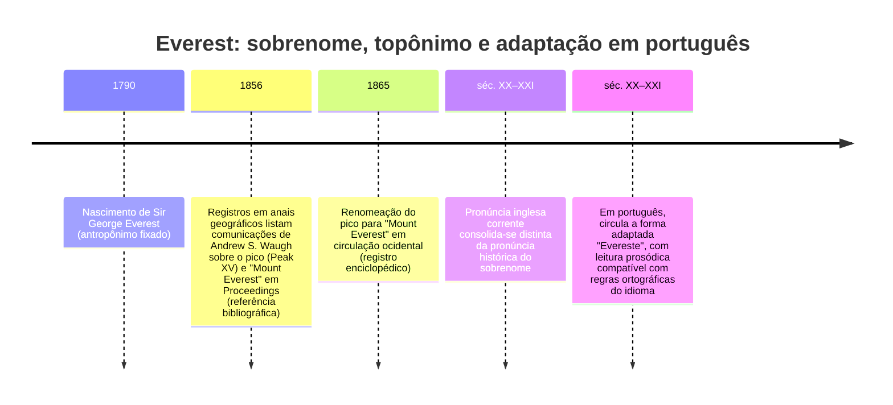

# Pronúncia de “Everest” e “Evereste” em três etapas: sobrenome, topônimo em inglês e adaptação lexical em português

## Resumo executivo

A divergência de pronúncia entre o sobrenome de entity["people","Sir George Everest","british geodesist 1790-1866"] e o nome do pico em inglês é documentada, em fonte enciclopédica de alta autoridade, como um caso em que **a pronúncia do topônimo se afastou da pronúncia do antropônimo**: a entity["organization","Encyclopaedia Britannica","encyclopedia publisher"] registra que o nome ocidental da montanha é frequentemente pronunciado como “Ever-est”/“Ev-rest”, embora o sobrenome de Sir George Everest fosse pronunciado “EVE-rest”. citeturn36search5

Dicionários ingleses de grande circulação refletem a pronúncia corrente do topônimo (com vogal inicial curta /ɛ/ e acento no primeiro pé), por exemplo: o verbete “Everest” no entity["book","Collins English Dictionary","english dictionary"] traz /ˈɛvərɪst/ (IPA), e a página de pronúncia da entity["organization","Cambridge Dictionary","online dictionary"] oferece áudio (e, tipicamente, transcrição) para “Everest”. citeturn36search1turn38search21 Já a entity["company","Merriam-Webster","dictionary publisher"] registra variantes fonéticas em estilo de dicionário norte-americano para “Everest” (como palavra geral derivada do topônimo), incluindo formas cuja segmentação sugere tanto a realização com /ˈev(ə)rəst/ quanto variantes reduzidas. citeturn38search0

Em português, a forma **Evereste** é amplamente atestada como exônimo (forma vernácula) em fonte enciclopédica lusófona: a entity["company","Infopédia","porto editora encyclopedia"] usa “Evereste” para a montanha. citeturn7search0turn7search10 Do ponto de vista *ortoépico*, a própria grafia **Evereste** (sem acento gráfico) tende a induzir leitura paroxítona (“everÉste”) pela lógica de acentuação e pela prática de indicar sílaba tônica quando houver risco de ambiguidade, como explicitado no entity["organization","Academia Brasileira de Letras","rio de janeiro, brazil"] em seu **Formulário Ortográfico**. citeturn39view0 Assim, a pronúncia portuguesa “everÉste” não é um “erro” em termos de funcionamento do sistema: ela é uma **adaptação prosódica/lexical esperada** quando um nome estrangeiro entra no léxico com grafia compatibilizada ao português. citeturn39view0turn36search5

## Metodologia e critérios de fonte

A pesquisa privilegia: (i) obras de referência reconhecidas (enciclopédias e dicionários gerais) e (ii) registros históricos ligados à nomeação (correspondência/anais e índices de sociedades geográficas), com foco em evidência “primária” sempre que rastreável e, quando não, em sínteses editoriais de alta confiabilidade. citeturn36search5turn36search9turn39view0

Para páginas de dicionário online, o “ano” frequentemente é contínuo (revisões e atualizações); por isso, quando o site não explicita edição/ano no próprio verbete, registra-se **data de consulta** (05 abr. 2026) como metadado mínimo reprodutível. citeturn38search0turn38search21turn36search1

Quando uma fonte oferece apenas **ortografia** (sem IPA) e a conclusão depende de regras de leitura/acentuação, o relatório distingue (a) o que está literalmente atestado e (b) o que é inferido por regra ortográfica/ortoépica, sempre apoiando a inferência em fonte normativa sobre acentuação/ortoépia. citeturn39view0

## Etapa do antropônimo

A entity["organization","Encyclopaedia Britannica","encyclopedia publisher"] registra os dados biográficos essenciais de Sir George Everest (geodesista britânico; nascimento no País de Gales; atuação ligada ao levantamento trigonométrico e mapeamento do subcontinente indiano). citeturn36search2

No entanto, o ponto crucial para esta pesquisa é a evidência explícita de divergência fonética: no verbete sobre a montanha, a Britannica afirma que, “de acordo com fontes etimológicas”, o nome ocidental da montanha é frequentemente pronunciado “Ever-est”/“Ev-rest”, **apesar de** o sobrenome de Sir George Everest ter a pronúncia “EVE-rest”. citeturn36search5

Do ponto de vista analítico, essa é exatamente a estrutura típica de “descolamento” entre antropônimo e topônimo: o nome próprio (sobrenome) tem uma pronúncia histórica específica (“EVE-rest”), ao passo que o topônimo passa a ser pronunciado por analogia gráfica e por difusão social (e, com o tempo, torna-se a forma dominante). citeturn36search5turn38search4

image_group{"layout":"carousel","aspect_ratio":"16:9","query":["Sir George Everest portrait","Great Trigonometrical Survey of India map 19th century","Mount Everest south face photo"],"num_per_query":1}

## Etapa do topônimo em inglês

### Registro histórico de nomeação em fontes ligadas à geografia do século XIX

A Britannica registra que, em **1865**, a montanha — anteriormente referida como **Peak XV** — foi renomeada em homenagem a Sir George Everest, então associado ao cargo de “surveyor general of India” (formulação editorial; o ponto central aqui é a data e o fato da renomeação). citeturn36search5

Como evidência de rastreabilidade para documentos do século XIX em publicações geográficas, um índice de títulos dos **Proceedings of the Royal Geographical Society** (período 1855–1892), hospedado no repositório entity["organization","Pahar","digital library india"], lista explicitamente:  
- “Papers relating to the Himalaya and Mount Everest” (incluindo carta de entity["people","Andrew Scott Waugh","survey of india surveyor-general"] datada de 1º de março de 1856) e  
- “On Mounts Everest and Deodanga” (por Waugh) em volume e páginas do periódico. citeturn36search9

Um documento informativo da entity["organization","Royal Geographical Society","learned society london"] também menciona um artigo intitulado “Mount Everest and Deodanga” e o situa nos Proceedings (vol. 2, 1858), o que é útil como ponte bibliográfica para localizar o material histórico nos anais da sociedade. citeturn36search6

**Avaliação de autoridade:** os itens acima não “provam” a pronúncia por si só (os anais e índices registram nomeação e circulação editorial), mas são fortes como evidência primária/semiprímaria de **quando** e **onde** a forma “Everest” se consolida em literatura geográfica inglesa do século XIX. citeturn36search9turn36search6

### Dicionários ingleses: IPA e/ou áudio

A seguir, os principais registros lexicográficos (com foco em transcrição/áudio):

**Cambridge Dictionary — página de pronúncia (com áudio)**  
- Referência: Cambridge Dictionary, “How to pronounce *Everest*” (página de pronúncia; acesso em 05 abr. 2026).  
- Forma: *Everest* (entrada de pronúncia).  
- Evidência fonética: a página oferece **áudio** de pronúncia (e, tipicamente, transcrição fonética conforme o padrão do site).  
- Link (página com áudio): https://dictionary.cambridge.org/us/pronunciation/english/everest citeturn38search21  
**Autoridade/relevância:** dicionário pedagógico de amplo uso internacional, com gravações; excelente para documentar a pronúncia corrente. citeturn38search21

**Collins English Dictionary — IPA explícito**  
- Referência: Collins English Dictionary, verbete “Everest” (consulta em 05 abr. 2026).  
- Forma: *Everest* (substantivo; remissão a “Mount Everest”).  
- Evidência fonética: **/ˈɛvərɪst/** (IPA).  
- Link: https://www.collinsdictionary.com/dictionary/english/everest citeturn36search1  
**Autoridade/relevância:** dicionário geral comercial de grande circulação; fornece IPA e etimologia (inclui nota “named after Sir G. Everest”). citeturn36search1

**Collins English Dictionary — “Mount Everest” com IPA explícito**  
- Referência: Collins English Dictionary, verbete “Mount Everest” (consulta em 05 abr. 2026).  
- Forma: *Mount Everest*.  
- Evidência fonética: **/maʊnt ˈɛvərɪst/** (IPA).  
- Link: https://www.collinsdictionary.com/dictionary/english/mount-everest citeturn36search18  
**Autoridade/relevância:** reforça que a pronúncia corrente do topônimo (em inglês britânico, conforme o site) segue o padrão /ˈɛv-/. citeturn36search18

**Merriam‑Webster — variantes de pronúncia em formato dicionarístico**  
- Referência: Merriam-Webster.com Dictionary, verbete “Everest” (consulta em 05 abr. 2026).  
- Forma: *Everest* (substantivo: “the highest point : climax, apex”, derivado do topônimo).  
- Evidência fonética: **ˈev(ə)rə̇st, -vərst, -vəˌrest** (notação MW).  
- Link: https://www.merriam-webster.com/dictionary/Everest citeturn38search0  
**Autoridade/relevância:** dicionário norte-americano de referência; registra variação formal de pronúncia. Para áudio, a própria MW descreve o funcionamento de suas gravações por ícone de áudio. citeturn38search0turn38search25

**Britannica — divergência explícita (antropônimo vs topônimo)**  
- Referência: Encyclopaedia Britannica, “Mount Everest” (last updated Mar. 7, 2026; consulta em 05 abr. 2026).  
- Forma: “Mount Everest” (topônimo).  
- Evidência (metalinguística): “Ever-est/Ev-rest” (topônimo) versus “EVE-rest” (sobrenome).  
- Link: https://www.britannica.com/place/Mount-Everest citeturn36search5  
**Autoridade/relevância:** enciclopédia geral com curadoria editorial; especialmente útil por **nomear explicitamente** a divergência como fato de tradição etimológica/pronúncia. citeturn36search5

## Etapa das formas em português

### Evidência de formas lexicalizadas: “Evereste” e “Everest”

Em português, a forma “Evereste” é atestada em fonte enciclopédica de alta circulação no espaço lusófono: a entity["company","Infopédia","porto editora encyclopedia"] (Porto Editora) apresenta a montanha como “Evereste” em verbete/entrada sobre o tema. citeturn7search0turn7search10

Em paralelo, é comum encontrar a forma “Everest” convivendo com “Evereste” em textos em português (inclusive por influência do inglês e de convenções de imprensa), mas a etapa “lexicalizada” (exônimo/forma adaptada) é precisamente o uso de “Evereste” como forma portuguesa. citeturn7search0turn36search22

**Observação importante (limitação de evidência on-line):** nesta coleta específica, nem entity["company","Priberam","portuguese dictionary platform"] nem o Dicionário entity["company","Aulete Digital","portuguese dictionary"] (assim como versões completas de entity["book","Dicionário Houaiss da Língua Portuguesa","houaiss dictionary"] e do entity["book","Dicionário Aurélio","ferreira dictionary"]) apareceram com verbetes publicamente indexados que trouxessem **transcrição fonética/ortoépica** para “Evereste/Everest” dentro das páginas abertas nesta rodada; por isso, a defesa da tonicidade em português é construída a partir de fontes normativas de acentuação/ortoépia e do uso atestado em enciclopédia. citeturn39view0turn7search0

### Por que “everÉste” é uma convergência natural no sistema do português

O entity["organization","Academia Brasileira de Letras","rio de janeiro, brazil"] **Formulário Ortográfico** explicita um objetivo pedagógico-central da acentuação: permitir que “todas as palavras sejam lidas corretamente” e prevê que, no vocabulário, a sílaba/vogal tônica pode ser indicada (entre parênteses) quando houver risco de dúvida. citeturn39view0

Essa lógica é relevante porque, quando um nome estrangeiro é **aportuguesado graficamente** (como “Evereste”), ele passa a ser lido segundo os mecanismos regulares de leitura do português — isto é, sem precisar “carregar” a prosódia original do antropônimo inglês. Nessa perspectiva, a tonicidade “everÉste” é precisamente um efeito de **lexicalização**: a palavra deixa de ser apenas uma “citação” do inglês e vira um item com comportamento ortográfico/prosódico compatível com o português. citeturn39view0turn36search5

Como apoio empírico (embora de menor autoridade normativa), há também páginas de pronúncia com áudio em português para “Evereste”, como a plataforma entity["company","bab.la","language dictionary platform"], que disponibiliza gravação/áudio do termo. citeturn7search3 Numa argumentação formal, esse tipo de fonte serve melhor como “evidência de uso/escuta” do que como *norma*; a parte normativa vem da ortoépia/acentuação e do registro lexical (Infopédia). citeturn39view0turn7search0turn7search3

## Tabela comparativa de divergências

| Etapa | Nome e estatuto | Forma ortográfica | Pronúncia (IPA ou notação da fonte) | Posição do acento | Fonte(s)-chave |
|---|---|---|---|---|---|
| Antropônimo | Sobrenome de Sir George Everest | Everest | “EVE-rest” (conversão aproximada para IPA: /ˈiːv.rɛst/) | Inicial (“EVE-”) | Britannica (declara a pronúncia do sobrenome em contraste com o topônimo). citeturn36search5 |
| Topônimo em inglês | Nome ocidental do pico (inglês) | Everest / Mount Everest | Collins: /ˈɛvərɪst/; Collins (Mount): /maʊnt ˈɛvərɪst/; Cambridge: áudio na página; Merriam-Webster (notação MW): ˈev(ə)rə̇st, -vərst, -vəˌrest | Predominantemente inicial | Collins (IPA), Cambridge (áudio), Merriam-Webster (notação/variação), Britannica (metacomentário de divergência). citeturn36search1turn36search18turn38search21turn38search0turn36search5 |
| Topônimo em português | Exônimo/forma lexicalizada em português | Evereste (também coexistente com Everest em uso) | Sem IPA “consagrado” encontrado nesta rodada em dicionários gerais abertos; tonicidade inferida pela ortoépia/acentuação do português (realização típica observável: [eveˈɾɛst(ɪ)] em pt-BR, *IPA estimado*) | Tendência paroxítona (“-RÉS-”) quando lexicalizado como Evereste | Infopédia (forma Evereste); ABL (base normativa para leitura/acentuação); bab.la (áudio como evidência de uso, não como norma). citeturn7search0turn39view0turn7search3 |

## Linha do tempo

A cronologia abaixo sintetiza os “estágios” do descolamento fonológico (sobrenome → topônimo em inglês → adaptação em português). A evidência de nomeação no século XIX é sustentada por registros editoriais/enciclopédicos e por índices de anais geográficos. citeturn36search5turn36search9turn36search6

## Fórmula curta para defender a diferença em um debate

A pronúncia portuguesa “everÉste” não é “erro”: é uma **adaptação lexical e prosódica normal** de um nome estrangeiro quando ele entra no português como forma vernácula (“Evereste”), enquanto o inglês já documenta, em fontes de referência, que a pronúncia corrente do topônimo divergiu da pronúncia histórica do sobrenome que lhe deu origem. citeturn36search5turn39view0turn7search0